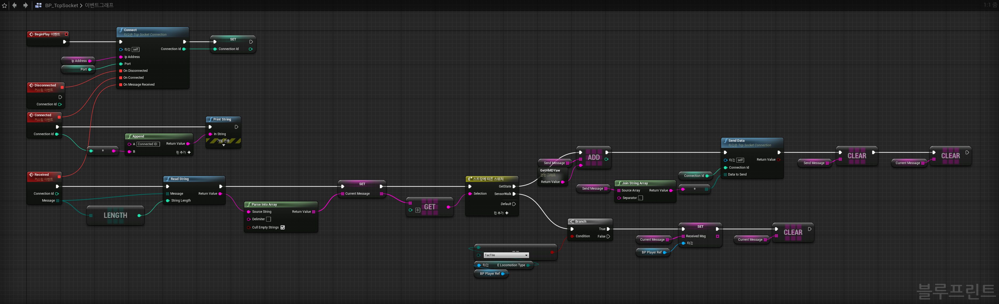
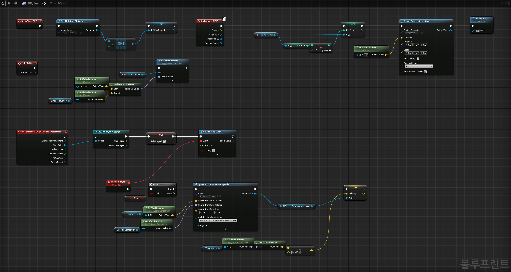
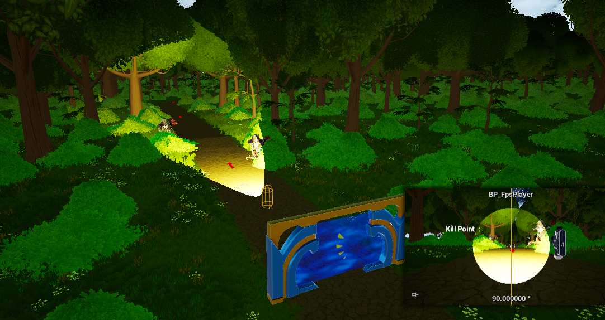

## SeamlessWalk
"Seamless-walk: Natural and Comfortable Virtual Reality Locomotion Method with a High-resolution Tactile Sensor", Virtual Reality, vol. 27, no. 2, pp. 1431-1445, June 2023 [[link]](https://link.springer.com/epdf/10.1007/s10055-023-00750-x?sharing_token=7gJEbtcZhXip0QIhRmGBI_e4RwlQNchNByi7wbcMAY6izZdKmXYzWslZeEg_7J-zOvtgl0OvUkk4y_NDgP--Y9l1v2g6F6T2_z14-78ZBP19Kl-HBK1tJtF5t05FWbg0FJKzm_PMXZK1nWwr_jHxivM7f8qAuSzSPq1BWScOV24%3D)
 

### 프로젝트 개요
1. 프로젝트 기간: 2022. 02 ~ 2022.08
2. 개발 도구 및 개발 환경:  
       

3. 참여 인원: 6인
4. 프로젝트 내에서 나의 역할
    - Oculus Quest 2에서 체험 가능한 VR 게임 개발 (UE 4.26, Blueprint 기반)
    - 센서 처리 프로세스(Python)와 VR 게임(UE4) 간의 통신 인터페이스 개발
    - 센서와 VR Controller 외 Treadmill, Foot Mouse, Nintendo Joystick 등 외부 장비를 사용한 캐릭터 조작 기능 구현
    - 인간 대상 사용성 테스트
    - 논문 작성
 

### 프로젝트 세부내용
해당 연구에서 전도성 천을 사용해 제작한 카펫 형태의 Tac-tile 센서 위에서 행동하는 사용자의 움직임을 예측하고 이를 VR 게임에 반영하는 연구 및 실험을 진행했습니다. 센서에서 예측한 사용자의 걷기, 뛰기, 정지, 이동방향에 해당하는 움직임을 TCP 통신을 사용하여 VR 게임에 전달하고 VR 게임은 수신한 데이터를 캐릭터에 움직임으로 적용합니다. 사용자는 맵에 표시된 길을 따라 걸으며, 길 주변에 등장하는 적을 처치하고 최단 시간내에 덜 맞으면서 목표 지점에 도달하는 것이 목표입니다. 개발 내용을 바탕으로 사용자 테스트를 진행했으며, 결과를 분석 후 논문으로 작성해 해외 저널 한 편을 게재했습니다. 

**1. 캐릭터 구현**
- Teleport, Arm-Swinging, Joy stick, Treadmill, Foot mouse, Nintendo controller 를 사용한 캐릭터 컨트롤 구현
- 캐릭터는 TCP 소켓에서 캐릭터 컨트롤에 필요한 데이터를 버퍼에 넣으면, 해당 데이터를 버퍼에서 가져와 컨트롤에 사용

 

**2. TCP 소켓 구현**
- 메시지(명령어) 기반으로 동작
- 센서 프로세스에서 송신한 'GetState'라는 메시지를 수신하면, 이동 방향을 추론하기 위해 HMD의 Yaw 값을 송신
- 센서 프로세스에서 송신한 'SensorWalk'라는 메시지를 수신하면, 명령어 이후에 포함되어 있는 움직임 타입, 속도 등을 캐릭터 클래스의 컨트롤을 위한 버퍼에 데이터를 넣음

 

**3. Enemy 구현**
- 탐지 범위 내에 캐릭터가 overlap 되면 캐릭터를 향하여 데미지 전달
- 캐릭터가 발사하는 투사체(Line Trace)에 맞으면 소멸

 

**4. Map 구현**
- 맵은 약 750m x 750m 크기에 2.6Km 길이의 길을 포함
- 드러난 길 주변에 분포된 나무 또는 수풀 사이에 적 배치

 

### UE4 프로젝트 링크
[Google Drive](https://drive.google.com/file/d/1dVoABTWGVv8NSFqHXiISrM31kKs8Hr3j/view?usp=drive_link)
 

### 시연 영상
[youtube link](https://www.youtube.com/watch?v=Gw79EJMgU-4)